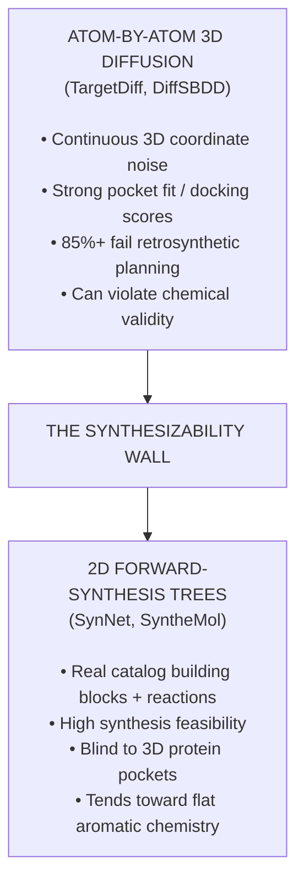
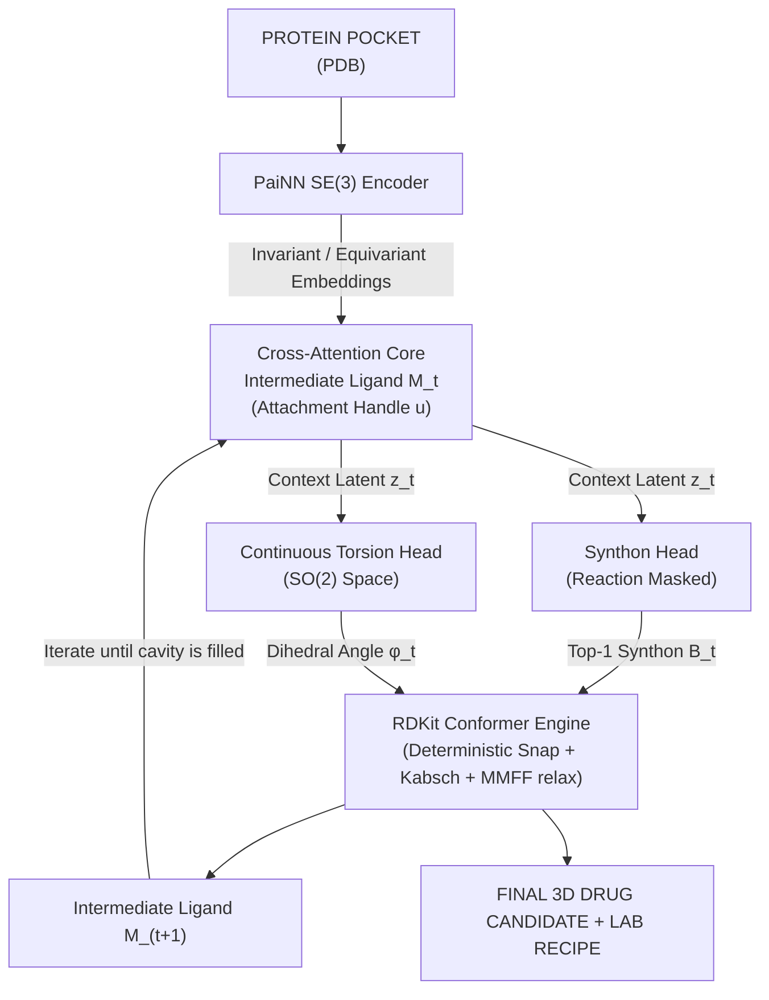

# 3D-SynTree: Structure-Based Molecular Design via Reaction-Constrained Synthon Assembly with 3D-Conformational Guidance

[](https://www.python.org/downloads/)
[](https://pytorch.org/)
[](https://www.pyg.org/)
[](https://www.rdkit.org/)
[](https://opensource.org/licenses/MIT)

---

## 1. Executive Summary

**3D-SynTree** is a structure-based drug design (SBDD) generative framework that
attacks the **synthesizability wall** in computational drug discovery.

Current 3D generative diffusion models (e.g., *TargetDiff*, *DiffSBDD*) construct
ligands by diffusing continuous coordinates of individual atoms inside a protein
pocket. While these models achieve strong computational docking scores, they
systematically generate **chemical chimeras**: pentavalent carbons, unstable
peroxides, extreme ring strain, and zero feasible synthesis routes (retrosynthetic
planning tools solve <20% of them). Conversely, forward-synthesis algorithms
(e.g., *SynNet*, *SyntheMol*) guarantee synthesis by assembling buyable building
blocks, but operate strictly in flat 2D space, generating aromatic, grease-like
compounds that cannot conform to complex 3D binding cavities.

**3D-SynTree bridges this divide.** We formulate 3D molecular design as a
**Markov Decision Process over a Reaction-Constrained Synthon Action Space with
Equivariant Dihedral Torsion Guidance**:

$$
\pi_\theta(a_t \mid \mathcal{P}, \mathcal{M}_t) = P(r_t \mid \mathcal{P}, \mathcal{M}_t) \times P(B_t \mid r_t, \mathcal{P}, \mathcal{M}_t) \times p(\phi_t \mid B_t, r_t, \mathcal{P}, \mathcal{M}_t)
$$

Instead of
$

Instead of placing unconstrained atoms, 3D-SynTree iteratively selects certified
building blocks (synthons) from a curated high-Fsp3 3D catalog, connects them
using validated medicinal-chemistry reaction rules, and predicts the continuous
single-bond dihedral angles (SO(2) space) that minimise steric clash within the
SE(3) protein pocket. **Every generated compound outputs both a 3D molecular
structure and an actionable, multi-step synthetic recipe.**

---

## 2. The Problem: The Synthesizability Wall



Three obstacles make this wall hard to tear down:

1. **The Representation Mismatch** – 3D pocket geometry lives in continuous
   Euclidean space, while chemical synthesis operates on a discrete,
   combinatorial graph grammar of reaction templates and functional groups.
2. **The Rigidity vs. Fit Dilemma** – restricting generation to real, stable
   building blocks means rigid bond angles (109.5°, 120°) can smash pieces
   into the pocket walls (steric clash).
3. **The "Flat Grease" Trap** – reaction-based models default to foolproof
   couplings (amide, Suzuki), linking flat aromatic rings with terrible Fsp3,
   poor solubility, and fast clinical clearance.

---

## 3. The 3D-SynTree Paradigm

Four architectural commitments break the wall:

1. **Lego-Rule Action Space** – the model never generates individual atoms.
   Every action attaches a pre-validated building block from a curated
   a real reaction-compatible building-block catalog (default curation: Fsp3 ≥ 0.40, MW 80–220 Da).
2. **Relative 3D Cross-Attention + Reaction Grammar** – the reacting handle
   includes chemical state plus pocket-frame position. Invariant handle-to-
   pocket distances condition the attention keys, while the reaction grammar
   masks chemically illegal synthons.
3. **Equivariant Torsion Guidance** – rather than predicting all atom
   coordinates, the 3D geometry of each added synthon is set by predicting the
   **dihedral angle** around the newly formed single bond with an
   SE(3)-equivariant network conditioned on pocket atoms, expressed as a
   von Mises distribution on the circle.
4. **Stratified 3D Synthon Catalog** – multifunctional linkers/expanders are
   distinguished from terminal caps. Early growth masks monofunctional caps,
   while a learned STOP action provides explicit termination control.



---

## 4. Mathematical Formulation

**Pocket Encoder (SE(3)-equivariant PaiNN).** Scalar features
$s_i \in \mathbb{R}^d$ and vector features $\vec{v}_i \in \mathbb{R}^{3 \times d}$
are updated over edges within cutoff $r_{\mathrm{cut}} = 5.0$ Å:

$$\vec{v}_i^{(l+1)}, s_i^{(l+1)} = \text{PaiNN-Update}\left(s_i^{(l)}, \vec{v}_i^{(l)}, \mathbf{X}_P\right)$$

**Synthon Selection
$

**Synthon Selection (reaction-masked cross-attention).** Given attachment
handle representation $\mathbf{q}_u$ and catalog embeddings
$\mathbf{E}_B \in \mathbb{R}^{K \times d}$:

$$\mathbf{p}_{\text{synthon}} = \text{Softmax}\left(\frac{\mathbf{q}_u \mathbf{E}_B^T}{\sqrt{d}} + \mathbf{M}_{\text{rxn}}\right)$$

where
$

where $\mathbf{M}_{\text{rxn}}(u, j) = 0$ if synthon $j$ can legally react with
handle $u$, and $-\infty$ otherwise.

**Dihedral Torsion Head (continuous SO(2) parameterization).** Emits von Mises
parameters $(\mu, \kappa)$:

$$p(\phi \mid \mu, \kappa) = \frac{\exp(\kappa \cos(\phi - \mu))}{2\pi I_0(\kappa)}$$

trained
$

trained via the exact circular negative log-likelihood (with a numerically
stable $\log I_0$), plus an auxiliary soft Lennard-Jones steric clash penalty:

$$\mathcal{L}_{\text{total}} = \mathcal{L}_{\text{synthon}} + \lambda_1 \mathcal{L}_{\text{torsion}} + \lambda_2 \sum_{i \in B_t} \sum_{j \in \mathcal{P}} \max\left(0, (r_i + r_j)^2 - \|\mathbf{x}_i(\phi) - \mathbf{x}_j\|^2\right)$$

**Atom provenance
$

**Atom provenance.** Reactions are executed with isotope-tagged reactants
(core: $1000+i$, synthon: $2000+j$), which survive RDKit's product construction
even when leaving groups are deleted — enabling exact 3D coordinate inheritance,
Kabsch rigid alignment onto the locked scaffold, and frozen-scaffold MMFF
relaxation of the junction bonds.

---

## 5. Repository Structure

```text
3d-syntree/
├── configs/
│   ├── default_config.json          # Master hyperparameter manifest
│   └── train_colab_12h.json         # 12-hour budgeted execution profile
├── notebooks/
│   └── run_3d_syntree.ipynb         # 7-cell headless Colab/Kaggle wrapper
├── syntree/
│   ├── chemistry/
│   │   ├── catalog.py               # Enamine 3D synthon loader & masks
│   │   ├── conformer.py             # 3D snapping, Kabsch, dihedrals, clashes
│   │   ├── reactions.py             # SMARTS engine + isotope provenance
│   │   └── validator.py             # PoseBusters-style validity checks
│   ├── data/
│   │   ├── crossdocked.py           # PyG dataset (real + synthetic modes)
│   │   ├── featurizer.py            # Pocket & handle featurization
│   │   └── synthon_library.py       # HDF5/NPZ embedding store
│   ├── models/
│   │   ├── equivariant.py           # PaiNN layers, radial basis, radius graph
│   │   ├── pocket_encoder.py        # SE(3) cavity encoder
│   │   ├── synthon_head.py          # Grammar-masked cross-attention
│   │   ├── torsion_head.py          # von Mises torsion head
│   │   └── policy.py                # End-to-end policy network
│   ├── engine/
│   │   ├── evaluator.py             # PoseBusters / retrosynthesis / docking
│   │   ├── generator.py             # Autoregressive SBDD inference
│   │   └── trainer.py               # Time-budgeted resilient training
│   └── utils/
│       ├── checkpoint.py            # Local + Hugging Face Hub sync
│       ├── hardware.py              # CUDA/TF32/mixed-precision profiling
│       └── logger.py                # JSONL metrics + WandB mirroring
├── scripts/
│   ├── download_assets.py           # Offline-capable asset builder
│   └── run_benchmarks.py            # Evaluation battery runner
├── tests/                           # 302 unit/integration tests
├── requirements.txt
├── setup.py / pyproject.toml
└── main.py                          # Unified CLI (train/generate/evaluate/info)
```

---

## 6. Quickstart

### Local installation

```bash
git clone https://github.com/Vtheonly/3d-syntree.git
cd 3d-syntree
pip install -r requirements.txt
pip install -e .
```

### Prepare thesis data

```bash
python scripts/build_synthon_catalog.py \\\n    --input /path/to/real_building_blocks.sdf \\\n    --output ./data/enamine_3d_subset.parquet \\\n    --min-fsp3 0.40 \\\n    --max-mw 220 \\\n    --strict-min-size 50000

python scripts/prepare_multidataset.py \\\n    --input-manifest /path/to/structural_sources.jsonl \\\n    --output-dir ./data/unified \\\n    --radius 10 \\\n    --min-seq-id 0.30 \\\n    --coverage 0.80

python scripts/download_assets.py \\\n    --target-dataset unified_multisource \\\n    --output-dir ./data
```

Production mode never fabricates a training catalog or silently falls back to mock pockets. The unified stage standardizes every source, aligns ligand/pocket coordinates, writes rejection and split manifests, and performs leakage-resistant protein clustering. Use `--offline-smoke` only for plumbing tests.

### Train (wall-clock budgeted, resumable)

```bash
python main.py --mode train --config configs/default_config.json --resume-auto
```

### Generate pocket-conditioned ligands + synthesis recipes

```bash
python main.py --mode generate --config configs/default_config.json \\
    --pocket data/crossdocked/sample_pocket.pdb --num-ligands 8 --resume-auto
```

### Evaluate

```bash
python scripts/run_benchmarks.py --sdf-dir outputs/
```

### Run the test suite

```bash
python -m pytest tests/ -q
```

---

## 7. Colab / Kaggle Execution (12-hour budget)

Open `notebooks/run_3d_syntree.ipynb` in Google Colab or Kaggle and hit
**Run All**. The notebook:

1. **Asks for your Hugging Face write token** via a hidden input prompt
   (auto-detected first from Colab/Kaggle secrets or `HF_TOKEN`; leave blank
   to keep checkpoints local-only).
2. Clones (or pulls) this repository.
3. Installs dependencies and verifies RDKit / PyTorch / PyG.
4. Verifies or prepares the real data assets; production mode never synthesizes training data.
5. Profiles the GPU (TF32 on Ampere+, fp16 on T4/V100).
6. Launches the time-budgeted training loop with automatic Hugging Face
   checkpoint sync every 2 epochs.
7. Verifies the remote checkpoint state.

**Disconnection immunity:** if Colab disconnects at hour 4, simply hit **Run All**
again — the trainer detects the remote checkpoints on the HF Hub, restores model +
optimizer + RNG state, and resumes from the correct epoch.

### GPU auto-scaling

A fresh `train` run on a CUDA device fills the card instead of idling at
~1 GB:

* **Model tier** — free VRAM >= 12 GB trains hidden 256 / 8 layers / 8 heads
  (T4, A100, ...); 8–12 GB trains 192/6/6; 4–8 GB trains 160/5/4; smaller
  runtimes keep the portable 128/4/4 default.
* **Batch size** — the trainer probes real forward+backward passes with
  doubling + binary refinement until peak reserved VRAM reaches
  `training.auto_scale.target_vram_fraction` (default 0.85, i.e. ~12 GB of a
  T4's 14.4 GB free). Gradient accumulation is rebalanced so the effective
  batch stays close to the configured value; probing is RNG-transparent and
  never updates weights.
* **Architecture persistence** — the (possibly scaled) model config is stored
  inside every checkpoint, so `generate` and resume runs rebuild the exact
  trained architecture even on a different GPU.

Controlled by `training.auto_scale` in the config (enabled in
`configs/train_colab_12h.json`, disabled in `configs/default_config.json`
for bit-reproducible reference runs). If the dataset is too small to fill
the card, the trainer prints a note suggesting a larger
`data.synthetic_samples` or the real CrossDocked data.

---

## 8. What is learned vs. guaranteed

The project deliberately separates **learned predictions** from **deterministic
chemical constraints**.

| Component | Mechanism | What a benchmark number means |
| :--- | :--- | :--- |
| Reaction-family prediction | Learned neural reaction head | Accuracy on held-out, reaction-validated CrossDocked decompositions |
| Synthon selection | Learned pocket/handle-to-catalog scoring + reaction mask | Top-1 / top-k accuracy; report both oracle-family and joint-policy results |
| Dihedral prediction | Learned von Mises torsion head | Circular error / NLL on held-out observed junction torsions |
| Chemical validity | RDKit reaction execution + sanitization | A hard construction constraint, not model intelligence |
| Recipe validity | Catalog membership + certified forward reaction replay | A property enforced by the action space, not a learned hit rate |
| Pose quality | RDKit conformers plus the neural torsion prediction | Must be measured separately with blinded docking / PoseBusters-style evaluation |
| Binding affinity | External docking / experimental assay | **Not trained by the core policy and not inferred from validity alone** |

### Real CrossDocked supervision

Real pocket/ligand pairs are no longer assigned random labels. The
ReactionConstrainedFragmenter searches non-ring single bonds, reconstructs
chemically meaningful precursor handles, matches the resulting synthon against
the filtered catalog, and then replays the forward reaction with the real
ReactionEngine.

A training example is accepted only when the replayed product has the same
molecular connectivity as the observed ligand and an observed 3D junction
torsion is available. Unmatched complexes are skipped rather than being
converted into fabricated targets.

SNAr and Buchwald-Hartwig substitutions share one learned aryl_amination
family because the final product structure does not contain enough information
to identify which experimental conditions produced that bond.

### Synthetic mode

The deterministic synthetic dataset remains available for CPU/Colab smoke
tests and unit tests. Its labels are intentionally learnable but synthetic.
It must not be used as evidence of molecular-design performance, and production
configs now disable automatic fallback to it.

### Evaluation policy

Claims about binding, docking, PoseBusters, retrosynthetic success, or wet-lab
hit rates must come from an explicit held-out evaluation using real complexes,
with the evaluation protocol and sample population reported alongside the
numbers. The core repository does not assume that a valid molecule binds its
target.

## 9. Thesis Training Pipeline

The implementation separates the scientific stages explicitly.

**Offline expert trajectories.** scripts/build_trajectories.py recursively inverts supported reactions on co-crystallized ligands, considers exact and high-Tanimoto catalog candidates, and accepts supervision only after exact forward replay reproduces observed connectivity. Accepted states retain crystal pocket coordinates and observed junction dihedral.

**Behavioral cloning.** Set data.trajectory_dataset_path to the generated trajectories.pt file and run Stage 1 training. Synthetic data remains restricted to explicit smoke-test configurations.

**Hotspot-conditioned seeding.** Protein residue chemistry is converted into deterministic positive, negative, donor, acceptor, and hydrophobic hotspots. Seed handles are anchored near compatible hotspots before clash-aware geometric refinement.

**PPO fine-tuning.** main.py --mode rl --resume-auto loads Stage 1 weights and optimizes the same chemistry-constrained generator with a multi-objective 3D reward. The reward supports GNINA/Vina docking plus clash avoidance, Fsp3, QED, and chemical validity. Missing docking tools never become fabricated docking scores.

### Action-space constraints

The synthon policy outputs K + 1 actions, where index K is the learned STOP action. During early growth, monofunctional terminal caps are masked until the scaffold reaches data.terminal_cap_min_mw (default 250 Da). Multifunctional catalog entries are indexed by every detected reactive handle.

## 10. Engineering Notes

* **Deterministic real-target extraction** – real labels require a catalog
  synthon match plus successful RDKit forward replay; there is no random
  target_synthon or target_dihedral path in real mode.
* **Leakage-resistant splits** – unified structural sources are clustered with MMseqs2 at 30% sequence identity and whole protein clusters are kept together. External benchmark clusters can be locked outside training.
* **Reaction policy** – the network predicts a reaction family before synthon
  selection. The synthon logits are then masked by the selected family and
  the current core handle.
* **Torsion integrity** – the neural torsion prediction is applied directly by
  default. A brute-force clash grid remains available as an explicit diagnostic
  option, but it no longer silently overwrites the model prediction.
* **Chemical guarantees** – catalog membership and RDKit reaction execution
  constrain the action space, but those guarantees are not presented as
  learned accuracy.
* **Determinism** – seeded everywhere (Python/NumPy/Torch); catalog embeddings
  are deterministic projections of Morgan fingerprints, so identical catalogs
  produce reproducible embedding tables.
* **Resilience** – the trainer checkpoints atomically and restores optimizer,
  scheduler, and RNG state. Legacy checkpoints can still be read after the
  reaction head expansion, with newly introduced parameters initialized fresh.
* **Security** – the HF write token is read exclusively from HF_TOKEN and
  never from committed configuration.
* **Testing** – run python -m pytest tests/ -q before treating a benchmark as
  valid.
## 11. Multi-Source Dataset Contract

For thesis runs, CrossDocked2020 is treated as one structural source rather than the definition of the full training distribution. The repository accepts a single manifest containing heterogeneous sources such as CrossDocked, BindingMOAD, and PDBbind exports, then normalizes every source before training.

### Structural normalization

Every complex is reduced to one model-facing contract: a configurable heavy-atom pocket radius (10 Å by default); protein-only model pockets; a shared ligand/pocket coordinate origin; explicit rejection reasons for malformed, missing-3D, metal-containing, artifact, very-small, and low-MW records; and preserved source/provenance plus optional affinity metadata.

### Leakage policy

The split happens only after all sources are combined. MMseqs2 clusters the complete union of protein sequences, and a protein cluster is never divided across train/validation/test. This prevents the same family represented under different PDB IDs or source databases from crossing the split boundary. External benchmarks can be marked with a non-training split such as `casf2016_test`; the whole corresponding cluster is then excluded from train/validation/test allocation.

### Building-block policy

The production catalog must come from a real library export. The curation script removes duplicates, applies MW/Fsp3 filters, indexes every detected reactive handle, and enforces a minimum unique-catalog size unless `--allow-small` is explicitly used for development. Repository-generated placeholder molecules remain available only in explicit smoke mode.

### Scientific interpretation

PDBbind affinity metadata is preserved for downstream analysis but is not silently converted into a training objective for the current generator. Cross-source records retain provenance so later experiments can report source-specific performance instead of treating heterogeneous supervision as interchangeable.

## 12. Known Thesis Boundaries

The repository enforces data and chemistry constraints, but those constraints are not scientific evidence by themselves. A valid RDKit product is not evidence of binding, a docking score is not experimental affinity, and a family-level split is not proof of biological generalization. Reported results must include the held-out population, curation rules, split policy, and evaluation tool/version.

## 13. License

MIT — see [LICENSE](LICENSE).
