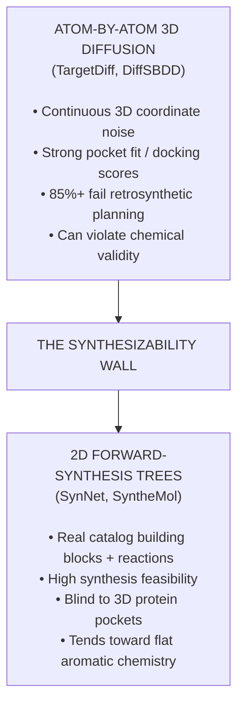
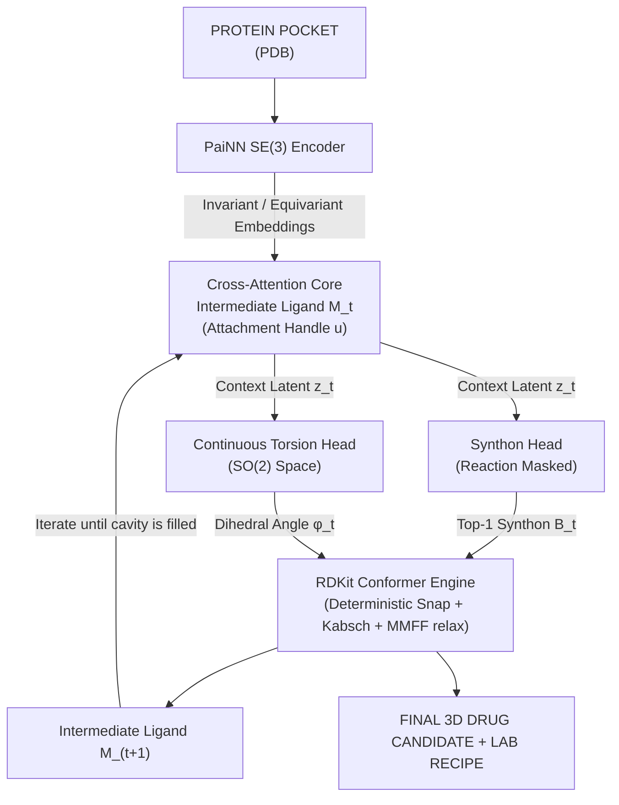
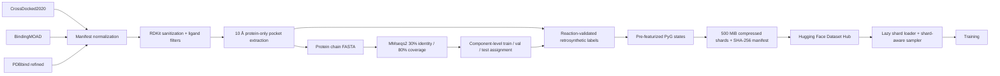

# 3D-SynTree: Structure-Based Molecular Design via Reaction-Constrained Synthon Assembly with 3D-Conformational Guidance

[](https://www.python.org/downloads/)
[](https://pytorch.org/)
[](https://www.pyg.org/)
[](https://www.rdkit.org/)
[](https://opensource.org/licenses/MIT)

---

## 1. Executive Summary

**3D-SynTree** is a structure-based drug design (SBDD) generative framework that
attacks the **synthesizability wall** in computational drug discovery.

Current 3D generative diffusion models (e.g., *TargetDiff*, *DiffSBDD*) construct
ligands by diffusing continuous coordinates of individual atoms inside a protein
pocket. While these models achieve strong computational docking scores, they
systematically generate **chemical chimeras**: pentavalent carbons, unstable
peroxides, extreme ring strain, and zero feasible synthesis routes (retrosynthetic
planning tools solve <20% of them). Conversely, forward-synthesis algorithms
(e.g., *SynNet*, *SyntheMol*) guarantee synthesis by assembling buyable building
blocks, but operate strictly in flat 2D space, generating aromatic, grease-like
compounds that cannot conform to complex 3D binding cavities.

**3D-SynTree bridges this divide.** We formulate 3D molecular design as a
**Markov Decision Process over a Reaction-Constrained Synthon Action Space with
Equivariant Dihedral Torsion Guidance**:

$$
\pi_\theta(a_t \mid \mathcal{P}, \mathcal{M}_t) = P(r_t \mid \mathcal{P}, \mathcal{M}_t) \times P(B_t \mid r_t, \mathcal{P}, \mathcal{M}_t) \times p(\phi_t \mid B_t, r_t, \mathcal{P}, \mathcal{M}_t)
$$

Instead of
$

Instead of placing unconstrained atoms, 3D-SynTree iteratively selects certified
building blocks (synthons) from a curated high-Fsp3 3D catalog, connects them
using validated medicinal-chemistry reaction rules, and predicts the continuous
single-bond dihedral angles (SO(2) space) that minimise steric clash within the
SE(3) protein pocket. **Every generated compound outputs both a 3D molecular
structure and an actionable, multi-step synthetic recipe.**

---

## 2. The Problem: The Synthesizability Wall



Three obstacles make this wall hard to tear down:

1. **The Representation Mismatch** – 3D pocket geometry lives in continuous
   Euclidean space, while chemical synthesis operates on a discrete,
   combinatorial graph grammar of reaction templates and functional groups.
2. **The Rigidity vs. Fit Dilemma** – restricting generation to real, stable
   building blocks means rigid bond angles (109.5°, 120°) can smash pieces
   into the pocket walls (steric clash).
3. **The "Flat Grease" Trap** – reaction-based models default to foolproof
   couplings (amide, Suzuki), linking flat aromatic rings with terrible Fsp3,
   poor solubility, and fast clinical clearance.

---

## 3. The 3D-SynTree Paradigm

Four architectural commitments break the wall:

1. **Lego-Rule Action Space** – the model never generates individual atoms.
   Every action attaches a pre-validated building block from a curated
   Enamine REAL 3D-Diversity subset (Fsp3 ≥ 0.42, MW ≤ 220 Da).
2. **Relative 3D Cross-Attention + Reaction Grammar** – the reacting handle
   includes chemical state plus pocket-frame position. Invariant handle-to-
   pocket distances condition the attention keys, while the reaction grammar
   masks chemically illegal synthons.
3. **Equivariant Torsion Guidance** – rather than predicting all atom
   coordinates, the 3D geometry of each added synthon is set by predicting the
   **dihedral angle** around the newly formed single bond with an
   SE(3)-equivariant network conditioned on pocket atoms, expressed as a
   von Mises distribution on the circle.
4. **Stratified 3D Synthon Catalog** – multifunctional linkers/expanders are
   distinguished from terminal caps. Early growth masks monofunctional caps,
   while a learned STOP action provides explicit termination control.



---

## 4. Mathematical Formulation

**Pocket Encoder (SE(3)-equivariant PaiNN).** Scalar features
$s_i \in \mathbb{R}^d$ and vector features $\vec{v}_i \in \mathbb{R}^{3 \times d}$
are updated over edges within cutoff $r_{\mathrm{cut}} = 5.0$ Å:

$$\vec{v}_i^{(l+1)}, s_i^{(l+1)} = \text{PaiNN-Update}\left(s_i^{(l)}, \vec{v}_i^{(l)}, \mathbf{X}_P\right)$$

**Synthon Selection
$

**Synthon Selection (reaction-masked cross-attention).** Given attachment
handle representation $\mathbf{q}_u$ and catalog embeddings
$\mathbf{E}_B \in \mathbb{R}^{K \times d}$:

$$\mathbf{p}_{\text{synthon}} = \text{Softmax}\left(\frac{\mathbf{q}_u \mathbf{E}_B^T}{\sqrt{d}} + \mathbf{M}_{\text{rxn}}\right)$$

where
$

where $\mathbf{M}_{\text{rxn}}(u, j) = 0$ if synthon $j$ can legally react with
handle $u$, and $-\infty$ otherwise.

**Dihedral Torsion Head (continuous SO(2) parameterization).** Emits von Mises
parameters $(\mu, \kappa)$:

$$p(\phi \mid \mu, \kappa) = \frac{\exp(\kappa \cos(\phi - \mu))}{2\pi I_0(\kappa)}$$

trained
$

trained via the exact circular negative log-likelihood (with a numerically
stable $\log I_0$), plus an auxiliary soft Lennard-Jones steric clash penalty:

$$\mathcal{L}_{\text{total}} = \mathcal{L}_{\text{synthon}} + \lambda_1 \mathcal{L}_{\text{torsion}} + \lambda_2 \sum_{i \in B_t} \sum_{j \in \mathcal{P}} \max\left(0, (r_i + r_j)^2 - \|\mathbf{x}_i(\phi) - \mathbf{x}_j\|^2\right)$$

**Atom provenance
$

**Atom provenance.** Reactions are executed with isotope-tagged reactants
(core: $1000+i$, synthon: $2000+j$), which survive RDKit's product construction
even when leaving groups are deleted — enabling exact 3D coordinate inheritance,
Kabsch rigid alignment onto the locked scaffold, and frozen-scaffold MMFF
relaxation of the junction bonds.

---

## 5. Repository Structure

```text
3d-syntree/
├── configs/
│   ├── default_config.json          # Master hyperparameter manifest
│   └── train_colab_12h.json         # 12-hour budgeted execution profile
├── notebooks/
│   └── run_3d_syntree.ipynb         # 7-cell headless Colab/Kaggle wrapper
├── syntree/
│   ├── chemistry/
│   │   ├── catalog.py               # Enamine 3D synthon loader & masks
│   │   ├── conformer.py             # 3D snapping, Kabsch, dihedrals, clashes
│   │   ├── reactions.py             # SMARTS engine + isotope provenance
│   │   └── validator.py             # PoseBusters-style validity checks
│   ├── data/
│   │   ├── crossdocked.py           # PyG dataset (real + synthetic modes)
│   │   ├── featurizer.py            # Pocket & handle featurization
│   │   └── synthon_library.py       # HDF5/NPZ embedding store
│   ├── models/
│   │   ├── equivariant.py           # PaiNN layers, radial basis, radius graph
│   │   ├── pocket_encoder.py        # SE(3) cavity encoder
│   │   ├── synthon_head.py          # Grammar-masked cross-attention
│   │   ├── torsion_head.py          # von Mises torsion head
│   │   └── policy.py                # End-to-end policy network
│   ├── engine/
│   │   ├── evaluator.py             # PoseBusters / retrosynthesis / docking
│   │   ├── generator.py             # Autoregressive SBDD inference
│   │   └── trainer.py               # Time-budgeted resilient training
│   └── utils/
│       ├── checkpoint.py            # Local + Hugging Face Hub sync
│       ├── hardware.py              # CUDA/TF32/mixed-precision profiling
│       └── logger.py                # JSONL metrics + WandB mirroring
├── scripts/
│   ├── download_assets.py           # Offline-capable asset builder
│   └── run_benchmarks.py            # Evaluation battery runner
├── tests/                           # 302 unit/integration tests
├── requirements.txt
├── setup.py / pyproject.toml
└── main.py                          # Unified CLI (train/generate/evaluate/info)
```

---

## 6. Quickstart

### Local installation

```bash
git clone https://github.com/Vtheonly/3d-syntree.git
cd 3d-syntree
pip install -r requirements.txt
pip install -e .
```

### Download assets (offline fallback included)

```bash
python scripts/download_assets.py --target-dataset crossdocked2020 \\
    --synthon-subset 3d-diversity-15k
```

With no network access the builder creates a chemically verified offline
catalog (Fsp3/MW computed with RDKit, handles detected by the real reaction
engine) plus a sample protein pocket, so the entire pipeline runs end-to-end.

### Train (wall-clock budgeted, resumable)

```bash
python main.py --mode train --config configs/default_config.json --resume-auto
```

### Generate pocket-conditioned ligands + synthesis recipes

```bash
python main.py --mode generate --config configs/default_config.json \\
    --pocket data/crossdocked/sample_pocket.pdb --num-ligands 8 --resume-auto
```

### Evaluate

```bash
python scripts/run_benchmarks.py --sdf-dir outputs/
```

### Run the test suite

```bash
python -m pytest tests/ -q
```

---

## 7. Colab / Kaggle Execution (12-hour budget)

Open `notebooks/run_3d_syntree.ipynb` in Google Colab or Kaggle and hit
**Run All**. The notebook is intentionally an execution/download wrapper; all
data processing, model logic, training, and checkpoint orchestration remain in
the codebase.

The production run uses two separate Hugging Face repositories:
* **Dataset:** `JJKK1212/3d-syntree-multidataset` (HF Dataset repo)
* **Model checkpoints:** `JJKK1212/3d-syntree-checkpoints` (HF Model repo)

The notebook:

1. **Asks for your Hugging Face write token** via a hidden input prompt
   (auto-detected first from Colab/Kaggle secrets or `HF_TOKEN`; leave blank
   to keep checkpoints local-only).
2. Clones (or pulls) this repository.
3. Installs dependencies and verifies RDKit / PyTorch / PyG.
4. Verifies the pre-filtered dataset manifests and exact synthon catalog from the HF Dataset repo.
5. Profiles the GPU (TF32 on Ampere+, fp16 on T4/V100).
6. Launches the time-budgeted training loop with automatic Hugging Face
   checkpoint sync every 2 epochs.
7. Verifies the remote checkpoint state.

**Disconnection immunity:** if Colab disconnects at hour 4, simply hit **Run All**
again — the trainer detects the remote checkpoints on the HF Hub, restores model +
optimizer + RNG state, and resumes from the correct epoch.

### GPU auto-scaling

A fresh `train` run on a CUDA device fills the card instead of idling at
~1 GB:

* **Model tier** — free VRAM >= 12 GB trains hidden 256 / 8 layers / 8 heads
  (T4, A100, ...); 8–12 GB trains 192/6/6; 4–8 GB trains 160/5/4; smaller
  runtimes keep the portable 128/4/4 default.
* **Batch size** — the trainer probes real forward+backward passes with
  doubling + binary refinement until peak reserved VRAM reaches
  `training.auto_scale.target_vram_fraction` (default 0.85, i.e. ~12 GB of a
  T4's 14.4 GB free). Gradient accumulation is rebalanced so the effective
  batch stays close to the configured value; probing is RNG-transparent and
  never updates weights.
* **Architecture persistence** — the (possibly scaled) model config is stored
  inside every checkpoint, so `generate` and resume runs rebuild the exact
  trained architecture even on a different GPU.

Controlled by `training.auto_scale` in the config (enabled in
`configs/train_colab_12h.json`, disabled in `configs/default_config.json`
for bit-reproducible reference runs). If the dataset is too small to fill
the card, the trainer prints a note suggesting a larger
`data.synthetic_samples` or the real CrossDocked data.

---

## 8. What is learned vs. guaranteed

The project deliberately separates **learned predictions** from **deterministic
chemical constraints**.

| Component | Mechanism | What a benchmark number means |
| :--- | :--- | :--- |
| Reaction-family prediction | Learned neural reaction head | Accuracy on held-out, reaction-validated CrossDocked decompositions |
| Synthon selection | Learned pocket/handle-to-catalog scoring + reaction mask | Top-1 / top-k accuracy; report both oracle-family and joint-policy results |
| Dihedral prediction | Learned von Mises torsion head | Circular error / NLL on held-out observed junction torsions |
| Chemical validity | RDKit reaction execution + sanitization | A hard construction constraint, not model intelligence |
| Recipe validity | Catalog membership + certified forward reaction replay | A property enforced by the action space, not a learned hit rate |
| Pose quality | RDKit conformers plus the neural torsion prediction | Must be measured separately with blinded docking / PoseBusters-style evaluation |
| Binding affinity | External docking / experimental assay | **Not trained by the core policy and not inferred from validity alone** |

### Real CrossDocked supervision

Real pocket/ligand pairs are no longer assigned random labels. The
ReactionConstrainedFragmenter searches non-ring single bonds, reconstructs
chemically meaningful precursor handles, matches the resulting synthon against
the filtered catalog, and then replays the forward reaction with the real
ReactionEngine.

A training example is accepted only when the replayed product has the same
molecular connectivity as the observed ligand and an observed 3D junction
torsion is available. Unmatched complexes are skipped rather than being
converted into fabricated targets.

SNAr and Buchwald-Hartwig substitutions share one learned aryl_amination
family because the final product structure does not contain enough information
to identify which experimental conditions produced that bond.

### Synthetic mode

The deterministic synthetic dataset remains available for CPU/Colab smoke
tests and unit tests. Its labels are intentionally learnable but synthetic.
It must not be used as evidence of molecular-design performance, and production
configs now disable automatic fallback to it.

### Evaluation policy

Claims about binding, docking, PoseBusters, retrosynthetic success, or wet-lab
hit rates must come from an explicit held-out evaluation using real complexes,
with the evaluation protocol and sample population reported alongside the
numbers. The core repository does not assume that a valid molecule binds its
target.

## 9. Thesis Training Pipeline

The implementation separates the scientific stages explicitly.

**Offline expert trajectories.** scripts/build_trajectories.py recursively inverts supported reactions on co-crystallized ligands, considers exact and high-Tanimoto catalog candidates, and accepts supervision only after exact forward replay reproduces observed connectivity. Accepted states retain crystal pocket coordinates and observed junction dihedral.

**Behavioral cloning.** Set data.trajectory_dataset_path to the generated trajectories.pt file and run Stage 1 training. Synthetic data remains restricted to explicit smoke-test configurations.

**Hotspot-conditioned seeding.** Protein residue chemistry is converted into deterministic positive, negative, donor, acceptor, and hydrophobic hotspots. Seed handles are anchored near compatible hotspots before clash-aware geometric refinement.

**PPO fine-tuning.** main.py --mode rl --resume-auto loads Stage 1 weights and optimizes the same chemistry-constrained generator with a multi-objective 3D reward. The reward supports GNINA/Vina docking plus clash avoidance, Fsp3, QED, and chemical validity. Missing docking tools never become fabricated docking scores.

### Action-space constraints

The synthon policy outputs K + 1 actions, where index K is the learned STOP action. During early growth, monofunctional terminal caps are masked until the scaffold reaches data.terminal_cap_min_mw (default 250 Da). Multifunctional catalog entries are indexed by every detected reactive handle.

## 10. Engineering Notes

* **Deterministic real-target extraction** – real labels require a catalog
  synthon match plus successful RDKit forward replay; there is no random
  target_synthon or target_dihedral path in real mode.
* **Non-overlapping deterministic splits** – paired CrossDocked examples are deterministically
  partitioned into train/val/test buckets instead of loading every pair into
  every split.
* **Reaction policy** – the network predicts a reaction family before synthon
  selection. The synthon logits are then masked by the selected family and
  the current core handle.
* **Torsion integrity** – the neural torsion prediction is applied directly by
  default. A brute-force clash grid remains available as an explicit diagnostic
  option, but it no longer silently overwrites the model prediction.
* **Chemical guarantees** – catalog membership and RDKit reaction execution
  constrain the action space, but those guarantees are not presented as
  learned accuracy.
* **Determinism** – seeded everywhere (Python/NumPy/Torch); catalog embeddings
  are deterministic projections of Morgan fingerprints, so identical catalogs
  produce reproducible embedding tables.
* **Resilience** – the trainer checkpoints atomically and restores optimizer,
  scheduler, and RNG state. Legacy checkpoints can still be read after the
  reaction head expansion, with newly introduced parameters initialized fresh.
* **Security** – the HF write token is read exclusively from HF_TOKEN and
  never from committed configuration.
* **Testing** – run python -m pytest tests/ -q before treating a benchmark as
  valid.
## 10.1 Unified multi-dataset thesis dataset pipeline

The production data path can combine CrossDocked2020, BindingMOAD, and PDBbind
without changing the model input schema. Raw sources remain local inputs because
their licensing and distribution layouts differ.



### Input manifest

For heterogeneous source layouts, a CSV or JSONL row should contain at least:

`source,complex_id,protein_path,ligand_path,resolution,subset`

`preprocess_multidataset.py` also supports recursive discovery when a source
uses a conventional <id>_protein.pdb and <id>_ligand.sdf|mol2 layout.

### Build sequence-cluster-safe splits

```bash
python scripts/preprocess_multidataset.py \
  --crossdocked-manifest ./raw_data/crossdocked.csv \
  --bindingmoad-manifest ./raw_data/bindingmoad.csv \
  --pdbbind-manifest ./raw_data/pdbbind_refined.csv \
  --output-dir ./data/multidataset

bash scripts/run_mmseqs_split.sh \
  ./data/multidataset/processed_manifest.jsonl \
  ./data/multidataset
```

The split stage links complexes that share a clustered protein chain and assigns
the resulting connected components to train, validation, or test. This prevents
a clustered protein chain from appearing in multiple splits. A 30% sequence
identity split supports sequence-level generalization claims; it does not by
itself prove unseen structural folds.

### Build real supervision and shard it

```bash
python scripts/build_trajectories.py --manifest ./data/multidataset/processed_manifest.jsonl --split-manifest ./data/multidataset/split_manifest.json --split train --catalog ./data/enamine_3d_subset.parquet --output ./data/trajectories_train.pt --max-steps 4
python scripts/build_trajectories.py --manifest ./data/multidataset/processed_manifest.jsonl --split val --split-manifest ./data/multidataset/split_manifest.json --catalog ./data/enamine_3d_subset.parquet --output ./data/trajectories_val.pt --max-steps 4
python scripts/build_trajectories.py --manifest ./data/multidataset/processed_manifest.jsonl --split test --split-manifest ./data/multidataset/split_manifest.json --catalog ./data/enamine_3d_subset.parquet --output ./data/trajectories_test.pt --max-steps 4
python scripts/shard_and_upload.py --input ./data/trajectories_train.pt --split train --output-dir ./data/shards --repo-id JJKK1212/3d-syntree-multidataset --max-shard-gb 0.50 --metadata-json ./data/trajectories_train.json
python scripts/shard_and_upload.py --input ./data/trajectories_val.pt --split val --output-dir ./data/shards --repo-id JJKK1212/3d-syntree-multidataset --max-shard-gb 0.50 --metadata-json ./data/trajectories_val.json
python scripts/shard_and_upload.py --input ./data/trajectories_test.pt --split test --output-dir ./data/shards --repo-id JJKK1212/3d-syntree-multidataset --max-shard-gb 0.50 --metadata-json ./data/trajectories_test.json
```

Shards are bounded by compressed byte size rather than fixed sample count.
The manifest stores sample ranges, compressed sizes, and SHA-256 hashes. The
training loader downloads a shard on first access and keeps a bounded local
LRU cache. The shard-aware sampler shuffles within each shard before moving
to another shard, avoiding pathological global random cross-shard access.

### Retrosynthesis coverage

The forward reaction engine defines eight certified reaction SMARTS, but a
co-crystallized product graph does not always contain enough information to
recover the experimental precursor uniquely. The current product-only
retrosynthesis implementation therefore accepts the five families declared in
`SUPPORTED_RETRO_FAMILIES` and requires exact forward replay after catalog matching.
Urea formation and click triazole are not silently converted into ground truth
without additional reaction provenance.

This distinction should remain explicit in the thesis: eight forward reaction
templates are available to the generator, while only product-invertible
transformations are used as supervised retrosynthetic labels unless external
reaction provenance is available.
## 11. License

MIT — see [LICENSE](LICENSE).


## 12. Research-grade contribution boundary

3D-SynTree is not claimed to be novel merely because it combines PaiNN, RDKit,
reaction SMARTS, cross-attention, or a synthon catalog. Those are established
components. The research contribution must be demonstrated empirically by
showing what the **chemistry-constrained 3D policy** adds beyond each component
and by using a leakage-safe benchmark.

The current research hypothesis is:

> A reaction-constrained autoregressive policy can learn target-conditioned
> choices over reaction family, purchasable synthon, and periodic junction
> torsion while retaining hard chemical validity, and PPO can optimize the
> resulting 3D designs against an external pocket oracle without relaxing the
> synthesis grammar.

This is a falsifiable hypothesis, not an acceptance claim.

### 12.1 What is actually novel here

The defensible unit of contribution is the **integrated constrained decision
process**, not the individual neural layers:

1. **Discrete reaction family** conditioned on the current reactive handle and
   protein-pocket context.
2. **Catalog-scale discrete synthon selection** under a reaction grammar.
3. **Continuous periodic torsion** for the newly created bond.
4. **Deterministic chemical execution** between policy decisions.
5. **Terminal multi-objective optimization** with PPO while preserving the same
   reaction/action constraints.
6. **Evaluation of the entire synthesis-and-geometry trajectory**, rather than
   reporting only a molecular validity percentage.

The repository therefore reports reaction accuracy, oracle-family synthon
accuracy, joint action accuracy, circular torsion NLL, chemical validity,
3D validity, diversity, novelty, docking, and independent retrosynthetic
solvability separately.

This distinction matters because recent 3D SBDD benchmarks show that generated
3D conformations can be invalid even when conventional docking scores look
strong. A valid relaxed pose and a low docking score are therefore not
interchangeable claims.

### 12.2 Required ablations

A thesis/paper run should contain at least these controlled variants:

| Variant | Reaction grammar | 3D pocket conditioning | Learned torsion | PPO |
| :--- | :---: | :---: | :---: | :---: |
| Random constrained | Yes | No | No | No |
| Catalog policy | Yes | Yes | No | No |
| 3D-SynTree BC | Yes | Yes | Yes | No |
| 3D-SynTree PPO | Yes | Yes | Yes | Yes |

Additional ablations should remove the handle-to-pocket distance features,
remove the reaction-family head, and replace the learned torsion with a
deterministic torsion diagnostic. These experiments establish whether each
architectural commitment contributes measurable information.

### 12.3 Baseline protocol

Published baselines such as TargetDiff, DiffSBDD, Pocket2Mol, SyntheMol, or
other contemporary SBDD systems should not be reimplemented inside this
repository merely to manufacture a comparison. Their official released
checkpoints/configurations should generate outputs for the **same target
manifest**, after which this repository evaluates the exported structures with
the same metric code.

Use:

```bash
python scripts/run_comparative_benchmark.py \
  --manifest ./benchmarks/targets.jsonl \
  --outputs ./benchmarks/outputs \
  --methods 3d-syntree,targetdiff,diffsbbd,synthemol \
  --limit 100
```

The target manifest must be frozen before model outputs are inspected. Target
selection, sequence clustering, ligand filtering, docking protocol, and
external retrosynthesis configuration must be shared across methods.

Do not call a model's self-reported benchmark numbers a head-to-head result.
A valid comparison requires the same targets, preprocessing, output budget,
docking protocol, and metric implementation.

### 12.4 Required primary metrics

The comparative report should include:

- chemical validity;
- 3D validity / PoseBusters-style validity;
- uniqueness;
- pairwise molecular diversity;
- novelty relative to the training corpus;
- mean and distributional Fsp3;
- molecular weight and other drug-like descriptors;
- independent retrosynthetic solve rate;
- docking score **only when the same external docking engine is available for
  every method**;
- target-conditioned success rate;
- synthesis-step statistics and action-space failure rate.

For a 3D generative model, docking alone is insufficient. The benchmark should
also examine bond-length, angle, torsion, and pocket-distance distributions
and, where appropriate, interaction recovery against the reference complex.

### 12.5 Pareto analysis

The phrase "break the Pareto frontier" is reserved for an observed result, not
an architectural assumption.

The final paper should plot at least:

- docking/pose quality vs independent synthesis success;
- docking/pose quality vs Fsp3;
- synthesis success vs molecular diversity;
- 3D validity vs docking score.

Confidence intervals or bootstrap intervals should be reported across targets.
A model occupies a useful trade-off region only if the observed data support
that statement.

### 12.6 Stage 2 PPO

Stage 1 is behavioral cloning from reaction-validated crystal decompositions.
Stage 2 is optional PPO fine-tuning:

```bash
python main.py \
  --mode rl \
  --config configs/rl_colab_12h.json \
  --resume-auto
```

PPO uses a terminal reward. The reward is decomposed into docking, clash,
Fsp3, QED, and chemical validity components. Docking is an external oracle:
when GNINA/Vina is unavailable, the repository does **not** fabricate a docking
score.

The action space remains chemistry-constrained throughout RL. PPO therefore
cannot directly propose an arbitrary atom graph or arbitrary bond geometry;
every non-STOP action still passes through the same reaction grammar and RDKit
reaction engine.

### 12.7 Important scientific limitation

The hybrid action space itself should not be presented as an unprecedented
mathematical construction. SynCoGen has already demonstrated joint
synthesis-aware 3D generation, while SHARP has demonstrated fragment-based
hierarchical action-space reinforcement learning for synthesizable molecular
optimization. The defensible contribution is therefore the particular
reaction-family -> catalog-synthon -> periodic-torsion factorization, explicit
RDKit reaction execution, target-conditioned torsion modeling, PPO training
protocol, and empirical evidence produced by this repository.

Likewise, high Fsp3 is not synonymous with good medicinal chemistry, and a
catalog membership guarantee is not equivalent to successful laboratory
synthesis. Independent retrosynthesis and, ultimately, experimental validation
remain necessary.

### 12.8 Reproducibility requirements

Every reported experiment should archive:

- exact Git commit;
- dataset repository revision and manifest hashes;
- synthon catalog hash;
- target manifest hash;
- model configuration;
- random seeds;
- checkpoint;
- docking executable/version and command configuration;
- PoseBusters version/configuration;
- AiZynthFinder version/configuration;
- generated SDFs and synthesis recipes;
- per-target raw metrics.

A paper table should never be produced from an unversioned mixture of local
datasets, checkpoints, and generated outputs.
