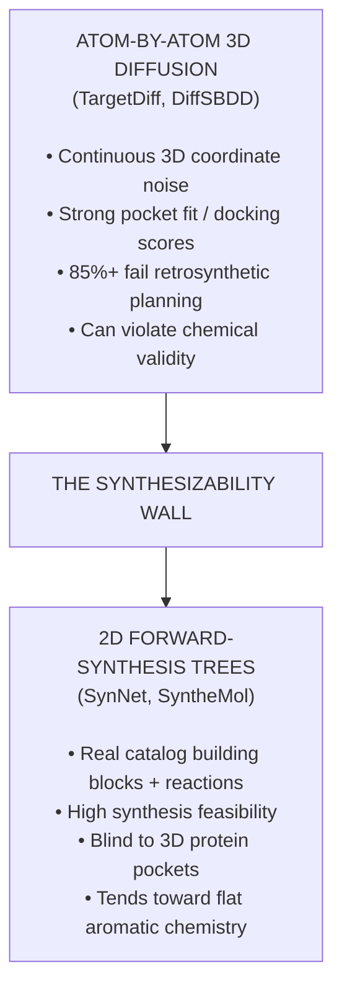
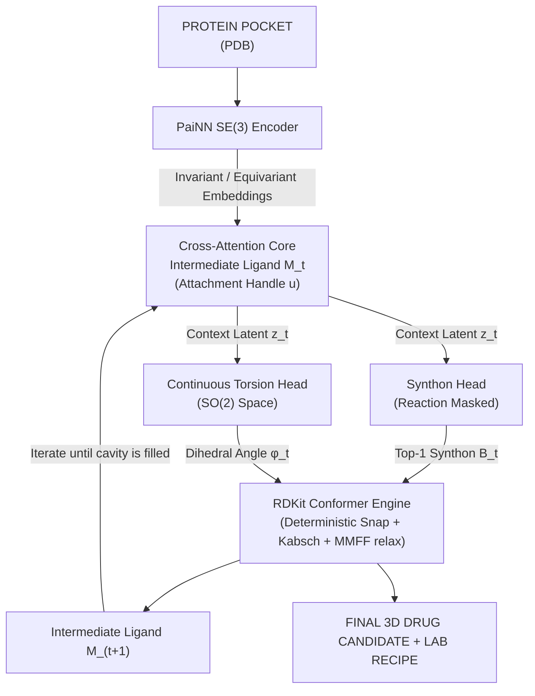

# 3D-SynTree: Structure-Based Molecular Design via Reaction-Constrained Synthon Assembly with 3D-Conformational Guidance

[](https://www.python.org/downloads/)
[](https://pytorch.org/)
[](https://www.pyg.org/)
[](https://www.rdkit.org/)
[]()
[](https://opensource.org/licenses/MIT)

---

## 1. Executive Summary

**3D-SynTree** is a structure-based drug design (SBDD) generative framework that
attacks the **synthesizability wall** in computational drug discovery.

Current 3D generative diffusion models (e.g., *TargetDiff*, *DiffSBDD*) construct
ligands by diffusing continuous coordinates of individual atoms inside a protein
pocket. While these models achieve strong computational docking scores, they
systematically generate **chemical chimeras**: pentavalent carbons, unstable
peroxides, extreme ring strain, and zero feasible synthesis routes (retrosynthetic
planning tools solve <20% of them). Conversely, forward-synthesis algorithms
(e.g., *SynNet*, *SyntheMol*) guarantee synthesis by assembling buyable building
blocks, but operate strictly in flat 2D space, generating aromatic, grease-like
compounds that cannot conform to complex 3D binding cavities.

**3D-SynTree bridges this divide.** We formulate 3D molecular design as a
**Markov Decision Process over a Reaction-Constrained Synthon Action Space with
Equivariant Dihedral Torsion Guidance**:

$
\\pi_\\theta(a_t \\mid \\mathcal{P}, \\mathcal{M}_t)
=
P(r_t \\mid \\mathcal{P}, \\mathcal{M}_t)
\\times
P(B_t \\mid r_t, \\mathcal{P}, \\mathcal{M}_t)
\\times
p(\\phi_t \\mid B_t, r_t, \\mathcal{P}, \\mathcal{M}_t)
$

Instead of placing unconstrained atoms, 3D-SynTree iteratively selects certified
building blocks (synthons) from a curated high-Fsp3 3D catalog, connects them
using validated medicinal-chemistry reaction rules, and predicts the continuous
single-bond dihedral angles (SO(2) space) that minimise steric clash within the
SE(3) protein pocket. **Every generated compound outputs both a 3D molecular
structure and an actionable, multi-step synthetic recipe.**

---

## 2. The Problem: The Synthesizability Wall



Three obstacles make this wall hard to tear down:

1. **The Representation Mismatch** – 3D pocket geometry lives in continuous
   Euclidean space, while chemical synthesis operates on a discrete,
   combinatorial graph grammar of reaction templates and functional groups.
2. **The Rigidity vs. Fit Dilemma** – restricting generation to real, stable
   building blocks means rigid bond angles (109.5°, 120°) can smash pieces
   into the pocket walls (steric clash).
3. **The "Flat Grease" Trap** – reaction-based models default to foolproof
   couplings (amide, Suzuki), linking flat aromatic rings with terrible Fsp3,
   poor solubility, and fast clinical clearance.

---

## 3. The 3D-SynTree Paradigm

Four architectural commitments break the wall:

1. **Lego-Rule Action Space** – the model never generates individual atoms.
   Every action attaches a pre-validated building block from a curated
   Enamine REAL 3D-Diversity subset (Fsp3 ≥ 0.42, MW ≤ 220 Da).
2. **Grammar-Masked Cross-Attention** – an explicit reaction-compatibility
   mask zeroes the logits of every synthon that cannot legally react with
   the ligand's exposed handle, so illegal chemistry is unrepresentable.
3. **Equivariant Torsion Guidance** – rather than predicting all atom
   coordinates, the 3D geometry of each added synthon is set by predicting the
   **dihedral angle** around the newly formed single bond with an
   SE(3)-equivariant network conditioned on pocket atoms, expressed as a
   von Mises distribution on the circle.
4. **3D-Enriched Synthon Catalog** – spirocyclic, bridged, and chiral
   building blocks dominate the library, giving true shape complementarity
   (aryl coupling partners are exempt from the Fsp3 floor because Suzuki /
   Buchwald / SNAr chemistry is aryl-by-definition).



---

## 4. Mathematical Formulation

**Pocket Encoder (SE(3)-equivariant PaiNN).** Scalar features
$s_i \in \mathbb{R}^d$ and vector features $\vec{v}_i \in \mathbb{R}^{3 \times d}$
are updated over edges within cutoff $r_{\\mathrm{cut}} = 5.0$ Å:

$
\\vec{v}_i^{(l+1)},\\; s_i^{(l+1)}
=
\\operatorname{PaiNN\\!\\!-\\!Update}
\\left(
 s_i^{(l)},
 \\vec{v}_i^{(l)},
 \\mathbf{X}_P
\\right)
$

**Synthon Selection (reaction-masked cross-attention).** Given attachment
handle representation $\mathbf{q}_u$ and catalog embeddings
$\mathbf{E}_B \in \mathbb{R}^{K \times d}$:

$
\\mathbf{p}_{\\mathrm{synthon}}
=
\\operatorname{Softmax}
\\left(
\\frac{\\mathbf{q}_u \\mathbf{E}_B^T}{\\sqrt{d}}
+
\\mathbf{M}_{\\mathrm{rxn}}
\\right)
$

where $\mathbf{M}_{\text{rxn}}(u, j) = 0$ if synthon $j$ can legally react with
handle $u$, and $-\infty$ otherwise.

**Dihedral Torsion Head (continuous SO(2) parameterization).** Emits von Mises
parameters $(\mu, \kappa)$:

$
p(\\phi \\mid \\mu,\\kappa)
=
\\frac{
\\exp\\left(\\kappa\\cos(\\phi-\\mu)\\right)
}{
2\\pi I_0(\\kappa)
}
$

trained via the exact circular negative log-likelihood (with a numerically
stable $\log I_0$), plus an auxiliary soft Lennard-Jones steric clash penalty:

$
\\mathcal{L}_{\\mathrm{total}}
=
\\mathcal{L}_{\\mathrm{synthon}}
+
\\lambda_1\\mathcal{L}_{\\mathrm{torsion}}
+
\\lambda_2
\\sum_{i\\in B_t}
\\sum_{j\\in\\mathcal{P}}
\\max\\left(
0,
(r_i+r_j)^2
-
\\left\\|
\\mathbf{x}_i(\\phi)-\\mathbf{x}_j
\\right\\|^2
\\right)
$

**Atom provenance.** Reactions are executed with isotope-tagged reactants
(core: $1000+i$, synthon: $2000+j$), which survive RDKit's product construction
even when leaving groups are deleted — enabling exact 3D coordinate inheritance,
Kabsch rigid alignment onto the locked scaffold, and frozen-scaffold MMFF
relaxation of the junction bonds.

---

## 5. Repository Structure

```text
3d-syntree/
├── configs/
│   ├── default_config.json          # Master hyperparameter manifest
│   └── train_colab_12h.json         # 12-hour budgeted execution profile
├── notebooks/
│   └── run_3d_syntree.ipynb         # 7-cell headless Colab/Kaggle wrapper
├── syntree/
│   ├── chemistry/
│   │   ├── catalog.py               # Enamine 3D synthon loader & masks
│   │   ├── conformer.py             # 3D snapping, Kabsch, dihedrals, clashes
│   │   ├── reactions.py             # SMARTS engine + isotope provenance
│   │   └── validator.py             # PoseBusters-style validity checks
│   ├── data/
│   │   ├── crossdocked.py           # PyG dataset (real + synthetic modes)
│   │   ├── featurizer.py            # Pocket & handle featurization
│   │   └── synthon_library.py       # HDF5/NPZ embedding store
│   ├── models/
│   │   ├── equivariant.py           # PaiNN layers, radial basis, radius graph
│   │   ├── pocket_encoder.py        # SE(3) cavity encoder
│   │   ├── synthon_head.py          # Grammar-masked cross-attention
│   │   ├── torsion_head.py          # von Mises torsion head
│   │   └── policy.py                # End-to-end policy network
│   ├── engine/
│   │   ├── evaluator.py             # PoseBusters / retrosynthesis / docking
│   │   ├── generator.py             # Autoregressive SBDD inference
│   │   └── trainer.py               # Time-budgeted resilient training
│   └── utils/
│       ├── checkpoint.py            # Local + Hugging Face Hub sync
│       ├── hardware.py              # CUDA/TF32/mixed-precision profiling
│       └── logger.py                # JSONL metrics + WandB mirroring
├── scripts/
│   ├── download_assets.py           # Offline-capable asset builder
│   └── run_benchmarks.py            # Evaluation battery runner
├── tests/                           # 302 unit/integration tests
├── requirements.txt
├── setup.py / pyproject.toml
└── main.py                          # Unified CLI (train/generate/evaluate/info)
```

---

## 6. Quickstart

### Local installation

```bash
git clone https://github.com/Vtheonly/3d-syntree.git
cd 3d-syntree
pip install -r requirements.txt
pip install -e .
```

### Download assets (offline fallback included)

```bash
python scripts/download_assets.py --target-dataset crossdocked2020 \\
    --synthon-subset 3d-diversity-15k
```

With no network access the builder creates a chemically verified offline
catalog (Fsp3/MW computed with RDKit, handles detected by the real reaction
engine) plus a sample protein pocket, so the entire pipeline runs end-to-end.

### Train (wall-clock budgeted, resumable)

```bash
python main.py --mode train --config configs/default_config.json --resume-auto
```

### Generate pocket-conditioned ligands + synthesis recipes

```bash
python main.py --mode generate --config configs/default_config.json \\
    --pocket data/crossdocked/sample_pocket.pdb --num-ligands 8 --resume-auto
```

### Evaluate

```bash
python scripts/run_benchmarks.py --sdf-dir outputs/
```

### Run the test suite

```bash
python -m pytest tests/ -q
```

---

## 7. Colab / Kaggle Execution (12-hour budget)

Open `notebooks/run_3d_syntree.ipynb` in Google Colab or Kaggle, add your
`HF_TOKEN` secret (write permission), and hit **Run All**. The notebook:

1. Configures credentials and runtime parameters.
2. Clones (or pulls) this repository.
3. Installs dependencies and verifies RDKit / PyTorch / PyG.
4. Downloads or synthesizes the data assets.
5. Profiles the GPU (TF32 on Ampere+, fp16 on T4/V100).
6. Launches the time-budgeted training loop with automatic Hugging Face
   checkpoint sync every 2 epochs.
7. Verifies the remote checkpoint state.

**Disconnection immunity:** if Colab disconnects at hour 4, simply hit **Run All**
again — the trainer detects the remote checkpoints on the HF Hub, restores model +
optimizer + RNG state, and resumes from the correct epoch.

---

## 8. Evaluation Targets

| Metric | TargetDiff / DiffSBDD | SynNet / SyntheMol | **3D-SynTree (target)** | Tool |
| :--- | :--- | :--- | :--- | :--- |
| Retrosynthetic feasibility | 10–20% | > 90% | **> 85%** | AiZynthFinder / proxy |
| PoseBusters pass rate | 30–50% | N/A | **> 90%** | Built-in validator |
| Chemical validity (valence) | 70–85% | 100% | **100%** | RDKit sanitization |
| Pocket affinity (kcal/mol) | −8.5 to −9.5 | N/A | **−8.0 to −9.0** | GNINA / Vina hooks |
| 3D complexity (Fsp3) | 0.35 | 0.20–0.28 | **≥ 0.45** | RDKit descriptors |
| Actionable synthesis recipe | 0% | 100% | **100%** | Native output |

External tools (GNINA, AiZynthFinder) are optional: the evaluator detects
their availability and degrades gracefully to internal RDKit metrics.

---

## 9. Engineering Notes

* **Determinism** – seeded everywhere (Python/NumPy/Torch); catalog
  embeddings are seeded random projections of Morgan fingerprints, so
  identical catalogs produce identical embeddings across machines.
* **Resilience** – the trainer wraps every run in a wall-clock budget,
  checkpoints atomically (tmp-file + rename), prunes stale checkpoints,
  and restores Python/NumPy/Torch/CUDA RNG states on resume.
* **Security** – the HF write token is read exclusively from the `HF_TOKEN`
  environment variable, never from config files that may be committed.
* **Robust chemistry** – reaction templates are validated against the
  installed RDKit version (H-count predicates and atom-map placement
  follow the modern parser grammar); the catalog re-verifies every
  declared handle from structure on load.
* **Test coverage** – 302 tests cover the reaction engine (provenance,
  junctions, product validity), SE(3) equivariance (rotation/translation
  invariance proofs), von Mises math (Bessel, sampling, NLL), end-to-end
  generation with recipe replay, checkpoint/resume (including RNG
  replay), and the CLI.

---

## 10. License

MIT — see [LICENSE](LICENSE).
